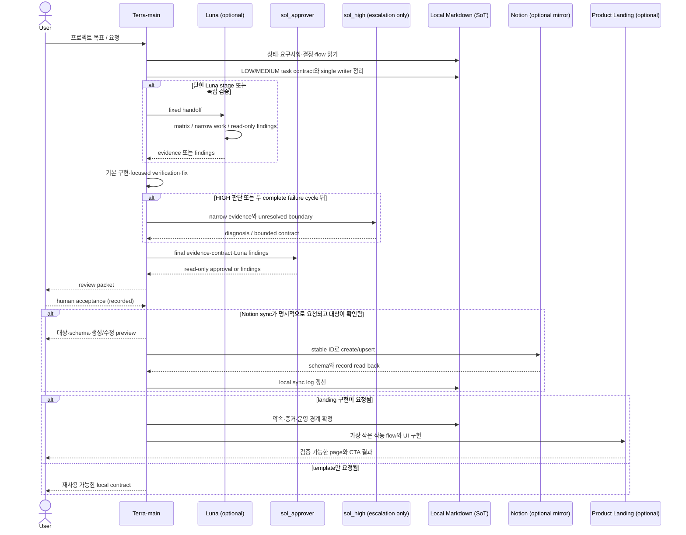

# System Map

한 번에 가장 중요한 사용자 흐름 하나를 실제 코드 기준으로 추적한다. 구현이 없는 hop은 만들지 말고 `해당 없음`, 확인하지 못한 hop은 `미확인`으로 적는다.

## Active flow

- Flow name: Terra-main contract → Luna (적용 시) → `sol_approver` → review packet → human acceptance
- User goal: 일반 구현은 단일 write owner가 끝내고, 닫힌 work·independent verification·HIGH 판단은 명시적으로 제한한다.
- Entry point: root `AGENTS.md`, `$project-harness` 요청과 `docs/STATE.md`
- Visible result: fixed task contract, focused-first verification, read-only final approval과 human acceptance가 연결된 review packet
- Last checked against repository: `2026-08-10 / v1.2 accepted baseline working tree`

프로젝트에 없는 participant는 제거하고 실제 symbol과 실패 흐름으로 바꾼다.

## Hop-by-hop trace

| Hop | File / symbol | Input → Output | Responsibility | Failure path | Verified? |
|---|---|---|---|---|---|
| User action | 사용자 요청 | 목표·reference → 요청 범위 | 문제·외부 write 범위 결정 | 중요한 프로젝트 사실 미확인 | `PASS` |
| Harness routing | `.agents/skills/project-harness/SKILL.md` | 요청 + local state → 다음 행동 | 관련 문서 읽기·최소 변경·검증 | 연결/결정 미확인 시 local-only | `PASS` |
| Terra-main contract | `.codex/config.toml`, `docs/AGENT_ROLES.md` | 사용자 요청 → task contract | LOW/MEDIUM scope·single writer·focused check | HIGH/new human decision이면 escalation | working-tree contract check `PASS` |
| Luna stage (optional) | `.codex/agents/luna-max.toml` | fixed handoff → matrix/narrow work/findings | closed stage 또는 independent read-only verification | 열린 판단·parallel write면 Terra-main/human에게 반환 | runtime discovery `NOT_RUN` |
| Sol approval / escalation | `.codex/agents/sol-approver.toml`, `.codex/agents/sol-high.toml` | evidence → approval 또는 diagnosis contract | `sol_approver` read-only final approval; `sol_high` restricted escalation | finding/new human decision이면 Terra-main/human에게 반환 | runtime discovery `NOT_RUN` |
| Local Source of Truth | `AGENTS.md`, `docs/*.md` | 확인된 사실 → stable local contract | 요구사항·결정·흐름·증거 보존 | 추측은 미확인으로 유지 | `PASS` |
| Notion mirror | `docs/REQUIREMENTS.md`, `docs/NOTION.local.md` | stable IDs → remote records | 수동 local→Notion preview/write/read-back | 미연결/schema mismatch면 write 중지 | Decisions `NOT_CONFIGURED` |
| Landing transform/render | `docs/DESIGN.md`, `docs/LANDING.md` | project facts → copy/UI/states | 약속·증거·운영 경계를 화면으로 변환 | 실제 project가 없으므로 해당 없음 | `NOT_RUN` |

## Contract and data lineage

| Boundary | Contract / schema | Source of Truth | Transformation | Consumer | Mock/Real |
|---|---|---|---|---|---|
| Request → active work | `R-###`, status vocabulary | `docs/REQUIREMENTS.md` | 현재 상태만 `docs/STATE.md`에 투영 | skill / implementation | `REAL` |
| Local decision → Notion | `ADR-###` / Decisions property contract | `docs/DECISIONS.md` | stable key upsert와 page body mapping | Notion Decisions DB | remote `NOT_CONFIGURED` |
| Project facts → landing | Landing brief / operating boundary / state contract | 실제 requirements·system map·evidence | copy와 UI section으로 선별 | prospective user | per project `UNKNOWN` |
| Terra-main → optional stage → approval | task contract / evidence / review packet | `docs/AGENT_ROLES.md` | Terra-main implementation → optional Luna findings → `sol_approver` approval | project result / Human | runtime discovery `NOT_RUN` |

### Mock boundary

- Selection mechanism: `docs/LANDING.md`에서 capability를 `REAL | MIXED | MOCK | PLANNED`로 표시한다.
- Production guard: `MOCK`과 `PLANNED`를 실제 제공 claim이나 primary CTA 근거로 사용하지 않는다.
- Shared contract test: 프로젝트 구현 시 `docs/SYSTEM_MAP.md` flow와 landing working flow를 대조한다.
- Remaining mock or fixture: 공통 하네스 자체에는 제품 mock이 없다.

## Responsibility split

- Backend guarantees: 공통 하네스에는 해당 없음. 프로젝트별 실제 endpoint에서 기록한다.
- Frontend decides: 공통 landing은 정보 우선순위와 상태 표현을 정하고, 업무 보장을 새로 만들지 않는다.
- Terra-main guarantees: 기존 사람 결정 안의 LOW/MEDIUM contract, single-writer implementation, focused verification, final regression과 review packet.
- Luna guarantees: fixed matrix·narrow stage 또는 independent read-only findings; same-worktree parallel write와 열린 판단은 하지 않음.
- `sol_approver` guarantees: evidence-based, read-only LOW/MEDIUM technical approval; product/config/test write와 broad rerun은 하지 않음.
- `sol_high` guarantees: HIGH/repeated-failure diagnosis·contract only; implementation과 broad regression은 하지 않음.
- Human decides: 문제, 우선순위, Source of Truth, 업무 규칙, 중요한 계약과 위험 수용.
- AI may propose: 현재 상태, 다음 vertical slice, 검증 방법, ADR 초안과 기록 후보.
- AI must not decide: 인간 소유 결정을 승인 상태로 확정하거나 검증하지 않은 성공을 주장하는 것.

## Test map

| Test | Boundary it proves | What it does not prove | Command / file | Status |
|---|---|---|---|---|
| Unit | shell script syntax | script의 runtime 의미 | `bash -n scripts/check-public.sh scripts/verify.sh scripts/check-commit-scope.sh` | `PASS` |
| Contract | 네 Notion DB·안정 키와 landing 필수 section | 실제 Notion schema / 렌더링 | 2026-08-05 contract check | `PASS` |
| Integration | public boundary, active routing reference와 review scope | external integration / runtime role discovery | `./scripts/check-public.sh`, stale scan, disposable-index scope check | `PASS` |
| Configuration E2E | named role discovery와 runtime model/effort | 실제 제품 구현 품질 | 새 trusted session에서 focused role discovery | `NOT_RUN` |
| E2E | 프로젝트별 사용자 행동부터 landing 결과 | 현재 제품 구현 없음 | 프로젝트에서 추가 | `NOT_RUN` |
| Failure | schema mismatch, missing facts와 partial capability 규칙 | 실제 remote error | 문서 contract review | `HUMAN_CHECK` |

## Ownership check

- [x] 하네스 진입점과 첫 routing 문서가 확인됐다.
- [x] local Markdown Source of Truth와 optional Notion mirror가 구분됐다.
- [x] stable ID와 landing copy로 형태가 바뀌는 위치가 확인됐다.
- [x] landing UI가 업무 보장을 새로 만들지 않는다는 책임이 구분됐다.
- [ ] 실제 프로젝트의 실패 응답 생성·표시 경로는 프로젝트 구현 시 확인한다.
