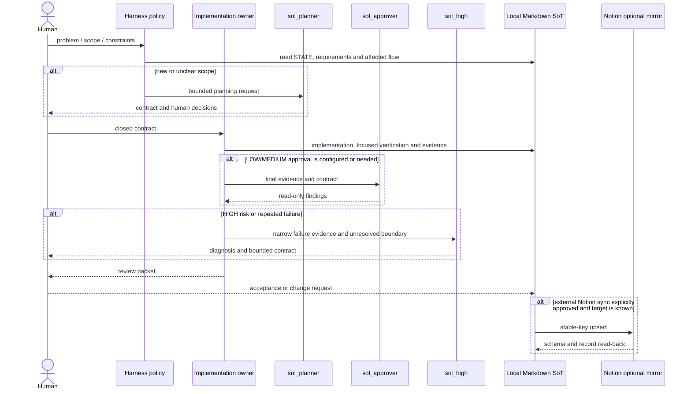

# System Map

이 문서는 공통 하네스의 사용자 행동·문서 계약·검증 흐름을 추적한다. 제품 코드가 없는 공통 저장소의 hop은 억지로 만들지 않고 `해당 없음` 또는 `미확인`으로 둔다.

## Active flow

- Flow: human request → current local state → bounded contract → implementation owner → focused evidence → conditional Sol review → review packet → human acceptance → closure batch
- User goal: 가장 얇은 가치 있는 흐름을 안전하게 구현하고, 실제 데이터 출처·실패 경로·사람 결정을 설명할 수 있다.
- Entry points: `AGENTS.md`, `docs/STATE.md`, `$project-harness`
- Visible result: 변경 경계, 검증 결과, 남은 결정과 다음 행동이 분리된 review packet
- Current candidate: `R-004` v1.3; user acceptance pending

## Hop-by-hop trace

| Hop | Source / contract | Input → output | Responsibility | Failure path | Verified |
|---|---|---|---|---|---|
| Human request | user message + `AGENTS.md` | problem/constraint → requested scope | problem, priority and external-write authority | ambiguity returns to human | `HUMAN_CHECK` |
| Current state | `docs/STATE.md` | snapshot → active unit/next action | current work, blockers and status | stale state is corrected before implementation | `PASS` for current file checks |
| Stable intent | `docs/REQUIREMENTS.md` | request → R-### acceptance | stable requirement and human decisions | unresolved rule remains `DRAFT`/`ACTIVE` | pending full document review |
| Implementation routing | `docs/AGENT_ROLES.md`, `.codex/agents/` | closed contract → owner/handoff | one writer and conditional escalation | unavailable role is `NOT_RUN` | role syntax `PASS`; runtime `NOT_RUN` |
| Verification | `scripts/verify.sh`, project hook | changed boundary → command result | focused/release distinction | absent hook is `NOT_RUN` / exit 2 | script syntax/help `PASS` |
| Evidence | `docs/EVIDENCE.md` | command → actual result and limits | no unrun `PASS`; record before review | failure remains visible | v1.3 candidate pending |
| Review/acceptance | review packet + human | evidence → acceptance/change request | Sol technical finding and human decision | `BLOCKER`/`MUST` or human change keeps `ACTIVE` | `NOT_RUN` |
| Closure | `docs/WORKLOG.md`, `STATE.md` | accepted unit → closure batch | summarize purpose, flow, SoT and verification | no acceptance means no closure | `NOT_RUN` |

## Contract and data lineage

| Boundary | Source of Truth | Transformation | Consumer | State |
|---|---|---|---|---|
| Request → active work | `REQUIREMENTS.md` | R-### and status projected into `STATE.md` | skill and implementation owner | `REAL` |
| Policy → role invocation | `AGENTS.md`, `AGENT_ROLES.md`, `.codex/` | contract → role/handoff | implementation/review agents | `REAL` / runtime `NOT_RUN` |
| Project command → evidence | project hook | stdout/exit code → EVIDENCE row | human/Sol review | `MIXED` |
| Local record → Notion | local docs + `NOTION.local.md` | approved stable-key upsert | optional Notion mirror | `NOT_CONNECTED` until configured |
| Common → web variant | common branch tree | overlay adds web-only design/landing/browser guidance | web project | local branch sync `PASS`; remote push pending |

## Responsibility split

- Common harness guarantees policy, documents, role boundaries, verification entry points and public/scope checks.
- A consuming project guarantees its frontend, API, domain, database, adapter and user-facing error path; those are `해당 없음` here.
- The implementation owner guarantees the closed contract, production/test changes, focused evidence and required docs.
- Sol roles provide only conditional planning, technical approval or HIGH/repeated-failure diagnosis according to [`AGENT_ROLES.md`](AGENT_ROLES.md).
- The human decides the problem, priority, Source of Truth, business rules, compatibility, architecture, risk acceptance and external writes.

## Failure and mock boundary

- A missing manifest or verification hook is not a successful no-op; it is `NOT_RUN`.
- Mock, planned or fixture data is labeled and cannot support a delivered product claim.
- A failed command is preserved as `FAIL`; tests are not deleted or bypassed to obtain `PASS`.
- The common harness has no product API, database or external adapter. Projects add those hops in their own map.

## Test map

| Level | Proves | Does not prove | Status |
|---|---|---|---|
| Static/config | shell, TOML/YAML and public/scope syntax | runtime role discovery | focused `PASS` where executed |
| Contract | docs, stable keys and hook semantics | project behavior | candidate `NOT_RUN` |
| Integration | project hook/adapter when supplied | absent project adapter | `NOT_RUN` |
| Browser/E2E | web project user action → rendered result | common harness behavior | web overlay/project-dependent |
| Failure | missing hook, invalid input, boundary mismatch handling | real external outage | hook absence `PASS` as expected `NOT_RUN`; rest pending |
