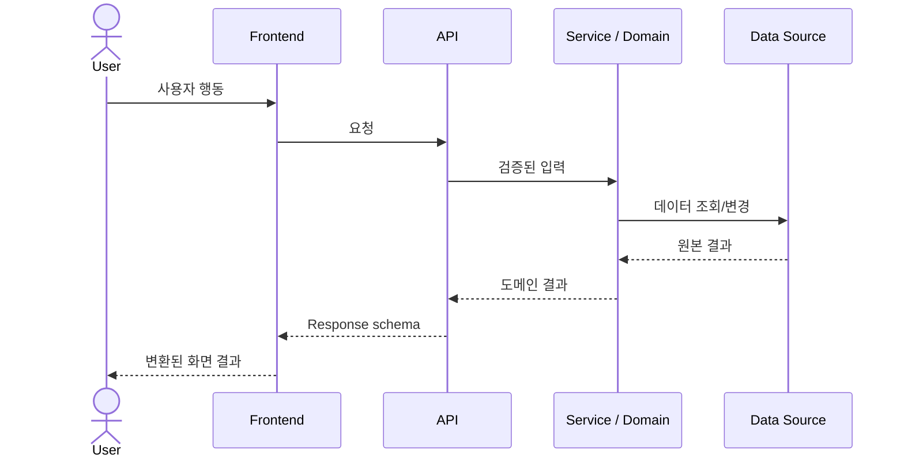

# System Map

한 번에 가장 중요한 사용자 흐름 하나를 실제 코드 기준으로 추적한다. 구현이 없는 hop은 만들지 말고 `해당 없음`, 확인하지 못한 hop은 `미확인`으로 적는다.

## Active flow

- Flow name: `미정`
- User goal: `미정`
- Entry point: `미확인`
- Visible result: `미정`
- Last checked against code: `NOT_RUN`

프로젝트에 없는 participant는 제거하고 실제 symbol과 실패 흐름으로 바꾼다.

## Hop-by-hop trace

| Hop | File / symbol | Input → Output | Responsibility | Failure path | Verified? |
|---|---|---|---|---|---|
| User action | `미확인` | `미확인` | 사용자 의도 | `미확인` | `NOT_RUN` |
| Frontend event/state | `미확인` | `미확인` | 화면·클라이언트 상태 | `미확인` | `NOT_RUN` |
| API request | `미확인` | `미확인` | 계층 간 입력 계약 | `미확인` | `NOT_RUN` |
| Backend endpoint | `미확인` | `미확인` | 인증·검증·응답 | `미확인` | `NOT_RUN` |
| Service/domain | `미확인` | `미확인` | 업무 규칙 | `미확인` | `NOT_RUN` |
| Data source | `미확인` | `미확인` | 실제 데이터 | `미확인` | `NOT_RUN` |
| Frontend transform/render | `미확인` | `미확인` | 화면 모델과 표시 | `미확인` | `NOT_RUN` |

## Contract and data lineage

| Boundary | Contract / schema | Source of Truth | Transformation | Consumer | Mock/Real |
|---|---|---|---|---|---|
| `미확인` | `미확인` | `미확인` | `미확인` | `미확인` | `UNKNOWN` |

### Mock boundary

- Selection mechanism: `미확인`
- Production guard: `미확인`
- Shared contract test: `미확인`
- Remaining mock or fixture: `미확인`

## Responsibility split

- Backend guarantees: `미확인`
- Frontend decides: `미확인`
- Human decides: 문제, 우선순위, Source of Truth, 업무 규칙, 중요한 계약과 위험 수용.
- AI may propose: 현재 상태, 다음 vertical slice, 검증 방법, ADR 초안과 기록 후보.
- AI must not decide: 인간 소유 결정을 승인 상태로 확정하거나 검증하지 않은 성공을 주장하는 것.

## Test map

| Test | Boundary it proves | What it does not prove | Command / file | Status |
|---|---|---|---|---|
| Unit | 함수와 도메인 규칙 | 실제 저장소·네트워크 연결 | `미정` | `NOT_RUN` |
| Contract | 생산자와 소비자의 데이터 형태 | 전체 사용자 흐름 | `미정` | `NOT_RUN` |
| Integration | API·service·adapter 연결 | 브라우저 렌더링 | `미정` | `NOT_RUN` |
| E2E | 사용자 행동부터 결과 화면 | 모든 예외 조합 | `미정` | `NOT_RUN` |
| Failure | 지연·빈 값·잘못된 응답·부분 실패 | 정상 경로 전체 | `미정` | `NOT_RUN` |

## Ownership check

- [ ] 버튼 또는 진입 행동 뒤 첫 실행 함수가 확인됐다.
- [ ] 실제 데이터 출처가 확인됐다.
- [ ] 데이터 형태가 바뀌는 계층이 확인됐다.
- [ ] Backend와 Frontend의 보장이 구분됐다.
- [ ] 실패 응답이 생성되고 표시되는 경로가 확인됐다.
